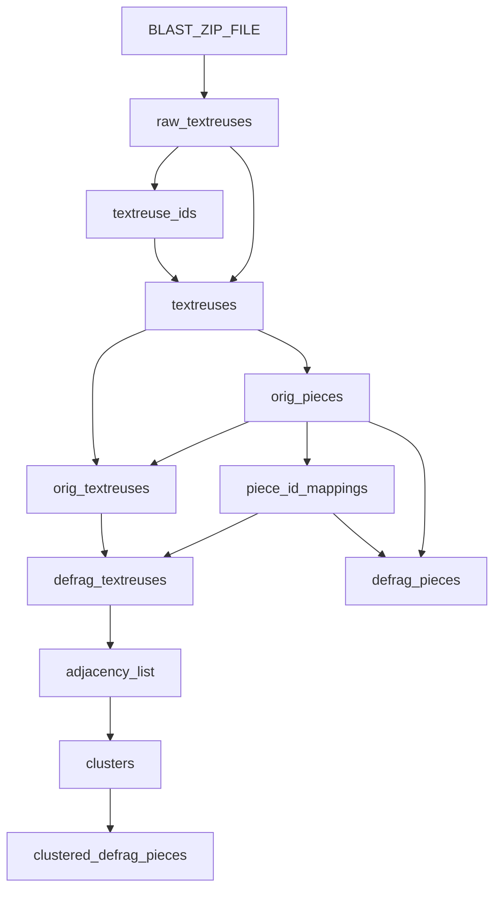

We describe the Dagster Assets from different groups. 

# Table of Contents
- [Table of Contents](#table-of-contents)
- [`textreuse` Assets](#textreuse-assets)
  - [Materialized Assets](#materialized-assets)
  - [`raw_textreuses` : Extracting Raw BLAST text reuses from zip file](#raw_textreuses--extracting-raw-blast-text-reuses-from-zip-file)
  - [`textreuse_ids` : Creating INT ids for each unique document](#textreuse_ids--creating-int-ids-for-each-unique-document)
  - [`textreuses`: Creating integer ids for each BLAST hit](#textreuses-creating-integer-ids-for-each-blast-hit)
  - [Normalizing the original BLAST hits](#normalizing-the-original-blast-hits)
  - [Defragmenting raw BLAST hits](#defragmenting-raw-blast-hits)
  - [Clustering the Text Reuse Graph](#clustering-the-text-reuse-graph)
  - [Dependency Graph](#dependency-graph)
- [`metadata` Assets](#metadata-assets)
  - [Materialized Assets](#materialized-assets-1)
  - [`newspapers_core`: Parsing Newspapers Metadata](#newspapers_core-parsing-newspapers-metadata)
  - [Levels of Metadata](#levels-of-metadata)
    - [Manifestation](#manifestation)
    - [Editions](#editions)
    - [Works](#works)
  - [`textreuse_sources` Raw Document Texts](#textreuse_sources-raw-document-texts)
- [`downstream_metadata` Assets](#downstream_metadata-assets)
  - [Materialized Assets](#materialized-assets-2)
  - [Actors and Authors](#actors-and-authors)
  - [Publication Dates](#publication-dates)
  - [Manifestation Titles and Source Lengths](#manifestation-titles-and-source-lengths)
- [`downstream_textreuse` and `denorm` Assets](#downstream_textreuse-and-denorm-assets)
  - [Materialized Assets](#materialized-assets-3)
  - [Reception Task Assets](#reception-task-assets)
  - [Coverages](#coverages)
    - [`coverages` : Standard Coverage Metric](#coverages--standard-coverage-metric)
    - [`reception_inception_coverages`: Coverage Metric Based on Reception](#reception_inception_coverages-coverage-metric-based-on-reception)
  - [Source Piece Statistics](#source-piece-statistics)

# `textreuse` Assets

In this section, we describe all the assets from `textreuse` group. These assets are related to the ETL of the raw BLAST data.

##  Materialized Assets

Upstream Assets:
   - `BLAST_ZIP_FILE`: Name of zip file with Raw BLAST Text Reuses

Materialized Assets
    - [`raw_textreuses`](/etl_textreuse/assets/raw_textreuses.py#L80)
    - [`textreuse_ids`](/etl_textreuse/assets/raw_textreuses.py#L141)
    - [`textreuses`](/etl_textreuse/assets/raw_textreuses.py#L181)
    - [`orig_pieces`](./orig_textreuses.py#L14)
    - [`orig_textreuses`](./orig_textreuses.py#L46)
    - [`piece_id_mappings`](./defragmentation.py#L14)
    - [`defrag_pieces`](./defragmentation.py#L42)
    - [`defrag_textreuses`](./defragmentation.py#L65)
    - [`adjacency_list`](./chinese_label_propagation.py#L32)
    - [`clusters`](./chinese_label_propagation.py#L58)
    - [`clustered_defrag_pieces`](./downstream_clusters.py#L15)

## `raw_textreuses` : Extracting Raw BLAST text reuses from zip file

Indicate the location of the S3 bucket and the name of zip file with the raw BLAST text reuses in the `.env` file:

```bash
RAW_BUCKET=<ALLAS BUCKET NAME>
BLAST_ZIP_FILE=<NAME OF BLAST ZIP FILE>
```

The structure of the zipfile should look like:  
```
tr_data_out_all.zip
|
|-tr_output_267.jsonl
|-tr_output_268.jsonl
|
```

Where each JSONL file has lines of raw text reuses from BLAST and each line looks like the following :

```json
{"text1_id": "0287901000", "text1_text_start": 87858, "text1_text_end": 87966, "text2_id": "0416900101", "text2_text_start": 3535059, "text2_text_end": 3535175, "align_length": 89, "positives_percent": 91.01}
```

The [`raw_textreuses`](/etl_textreuse/assets/raw_textreuses.py#L80) asset streams the ZIP file from the S3 bucket using Boto3, strams the JSON lines into a Parquet file with the following schema:

```bash
raw_textreuses
 |-- align_length: integer (nullable = true)
 |-- positives_percent: float (nullable = true)
 |-- text1_id: string (nullable = true)
 |-- text1_text: string (nullable = true)
 |-- text1_text_end: integer (nullable = true)
 |-- text1_text_start: integer (nullable = true)
 |-- text2_id: string (nullable = true)
 |-- text2_text: string (nullable = true)
 |-- text2_text_end: integer (nullable = true)
 |-- text2_text_start: integer (nullable = true)
```

## `textreuse_ids` : Creating INT ids for each unique document

Once the `raw_textreuses` has been materialized, we begin by creating integer ids for each unique source document of text reuse by looking at the `text1_id` and `text2_id` attributes. The three types of `text_id`s we have based on the document collections:

1. ECCO: 
    - A 0-padded 10-digit ECCO id
    - E.g., `"0000100100"`
2. EEBO-TCP:
    - Two part ID separated by a `.`:
      - First part: `A` or `B` followed by a five-digit number
      - Second Part: A structure name of where in the EEBO-TCP document the raw text is from
    - E.g.,`A00003.headed_1_text_2_body_note_at_6032`
    - 
3. Bl-Newspapers:
   - Newspaper article ID
   - E.g., `NICNF0317-C00000-N0000081-00020-001`

> [!IMPORTANT]  
>
> Due to the two-part ID from EEBO-TCP documents, the raw text source which is sent to BLAST is different from the physical manifestation of a document.

The [`textreuse_ids`](/etl_textreuse/assets/raw_textreuses.py#L141) asset splits the `text_id` (renamed to `text_name` in the asset) attribute into a `manifestation_id` and a `structure_name` which together identify a unique source of text reuse or a **TRS (text reuse source)**. Then the asset creates a unique integer `trs_id` ordered by the `manifestation_id` and `structure_name`. The schema of the asset is as follows:

```bash
textreuse_ids
 |-- trs_id: long (nullable = true)
 |-- text_name: string (nullable = true)
 |-- manifestation_id: string (nullable = true)
 |-- structure_name: string (nullable = true)   
```

## `textreuses`: Creating integer ids for each BLAST hit

Using the `raw_textreuses` and the `textreuse_ids` assets, we now map the `text1_id` and `text2_id` to the integer TRS ids `trs1_id` and `trs2_id`, respectively. Then the asset creates unique integer ids for each BLAST hit ordered by `trs1_id` and `trs2_id`. The asset schema is as follows:

```bash
textreuses
 |-- textreuse_id: long (nullable = true)
 |-- trs1_id: long (nullable = true)
 |-- trs1_start: integer (nullable = true)
 |-- trs1_end: integer (nullable = true)
 |-- trs2_id: long (nullable = true)
 |-- trs2_start: integer (nullable = true)
 |-- trs2_end: integer (nullable = true)
 |-- align_length: integer (nullable = true)
 |-- positives_percent: float (nullable = true)
```

## Normalizing the original BLAST hits

> [!IMPORTANT]  
>
> A **piece** is a unique fragment of text identified by a `trs_id` and a `trs_start` and `trs_end` offsets in the TRS.
>
> A **textreuse** is a pair of pieces identified by BLAST to be lexically similar.

We now normalize the `textreuses` asset into two assets, namely, [`orig_pieces`](./orig_textreuses.py#L14) and [`orig_textreuses`](./orig_textreuses.py#L46).

We collect all the unique pieces from the `textreuse` asset and create unique integer ids called `piece_id` and materialize the `orig_pieces` asset with the following schema:

```bash
org_pieces
 |-- piece_id: long (nullable = true)
 |-- trs_id: long (nullable = true)
 |-- trs_start: integer (nullable = true)
 |-- trs_end: integer (nullable = true)
```

Then using the pieces, we materialize the `orig_textreuses` asset as a mapping between pieces with the following schema:

```bash
orig_textreuses
 |-- piece_id: long (nullable = true)
 |-- trs_id: long (nullable = true)
 |-- trs_start: integer (nullable = true)
 |-- trs_end: integer (nullable = true)
```

## Defragmenting raw BLAST hits

<a name="fragmentation"></a>

**Fragmentation** occurs when the same passage of text has slightly different offsets when identified in different documents[^1].
This is caused due to the noisy OCR of digitized documents and the fuzzy nature of the BLAST algorithm.
In the <a href="#fragmentation">Figure</a> above each line depicts
a document from beginning to end, rectangles depict a piece’s start and
end offsets and the colors correspond to the reuse pairs. BLAST detects a
passage of text from document *D* being reused in documents *R1*, *R2* and
*R3*. Due to fragmentation the offsets of the three pieces in *D* differ slightly. The offsets of these fragmented pieces overlap significantly but are identified as different pieces.
Such fragmentation causes issues for downstream analysis tasks.

[^1]: [https://www.utupub.fi/bitstream/handle/10024/146706/Vesanto_Aleksi_opinnayte.pdf?sequence=1](https://www.utupub.fi/bitstream/handle/10024/146706/Vesanto_Aleksi_opinnayte.pdf?sequence=1).

To combat this, we "defragment" the raw hits by conservatively merging the pieces in each TRS. The logic/formula we follow for merging is that pieces to be merged, their start and end offsets need to be within 10 to 180 characters of each other, further limited so that the offset difference can be at a maximum 1/4 of the length of the piece.

This defragmentation logic is implemented as a Spark User Defined Aggregation Function (UDAF) `GetPieceIdMapping` in [piece_id_mapping.ipynb](./piece_id_mappings.ipynb). The UDAF is used on the `orig_pieces` asset dataframe to create a mapping of original pieces to ones which should be merged in the `piece_id_mappings` asset with the following schema:

```bash
piece_id_mappings
 |-- orig_piece_id: long (nullable = true)
 |-- defrag_piece_id: long (nullable = true)
```

The [`piece_id_mappings`](./defragmentation.py#L14) asset executes the Jupyter Notebook which materializes the dataframe in the S3 storage. 
> [!WARNING]  
>
> The `piece_id_mappings.ipynb` is a notebook that uses Spark, Scala 2.12 and Ammonite REPL. Please ensure the Spark driver is configured with the correct dependencies.

Using the materialized `piece_id_mappings` asset, we create the new [`defrag_pieces`](./defragmentation.py#L42) asset by merging the original pieces from BLAST with the following schema similar to `orig_pieces`:

```bash
defrag_pieces
 |-- piece_id: long (nullable = true)
 |-- trs_id: long (nullable = true)
 |-- trs_start: integer (nullable = true)
 |-- trs_end: integer (nullable = true)
```

Then we merge the reuse hits into [`defrag_textreuses`](./defragmentation.py#L65) asset which contains a `num_original_lins` attribute indicating how many original BLAST hits have been merged into this new defragmented text reuse hit. We also create new integer `textreuse_id` to uniquely identify each defragmented hit. Its schema is similar to the `orig_textreuses` schema:

```bash
defrag_textreuses
 |-- textreuse_id: long (nullable = true)
 |-- piece1_id: long (nullable = true)
 |-- piece2_id: long (nullable = true)
 |-- num_orig_links: long (nullable = true)
```

## Clustering the Text Reuse Graph

The next step in the processing is to cluster the graph network formed by the pieces as the nodes and the text reuses as the edges.

First, we materialize the [`adjacency_list`](./chinese_label_propagation.py#L32) asset consisting of each defragmented piece and all the pieces it was linked to via text reuse in the `other_pieces_ids` list, with the following schema:

```bash
adjacency_list
 |-- piece_id: long (nullable = true)
 |-- other_piece_ids: array (nullable = true)
 |    |-- element: long (containsNull = true)
```

Then, the [`clusters`](./chinese_label_propagation.py#L58) asset runs a Map-Reduce version of the Chinese Whispers Algorithm on the graph defined by the `adjacency_list`. The algorithm is run iteratively with each even iteration being saved in the `clusters_counts_0.parquet` file and every odd iteration saved in the `clusters_counts_1.parquet`. The schema of these files are as follows:

```bash
clusters_counts_*.py
 |-- piece_id: long (nullable = true)
 |-- cluster_id: long (nullable = true)
 |-- cluster_counts: map (nullable = true)
 |    |-- key: long
 |    |-- value: long (valueContainsNull = true)
 |-- active: string (nullable = true)
```

> [!WARNING]
> Currently the `clusters` asset might be unstable for large graphs. The asset begins from a hard-coded `iter` variable in the code. If the asset crashes in Dagster, please check the last successful iter and then appropriately update the `iter` variable in the asset and re-materialize the asset.

After the clustering algorithm has finished (typically for an even number of iterations), the [`clustered_defrag_pieces`](./downstream_clusters.py#L15) asset uses the `clusters_counts_0.parquet` file to create a mapping between the clusters and the defragmented pieces with the following schema:

```bash
 |-- piece_id: long (nullable = true)
 |-- cluster_id: long (nullable = true)
```

## Dependency Graph



# `metadata` Assets

The metadata assets parsed from the upstream sources.
The upstream assets required are described in [/etl_textreuse/README.md](../README.md#upstream-assets). These assets need to be uploaded to the same `RAW_BUCKET` location on Allas.

## Materialized Assets

All the materialized metadata assets

- [`newspapers_core`](./upstream_metadata.py#L17)
- [`manifestation_ids`](./ids_and_mappings.py#L17)
  - [`textreuse_manifestation_mapping`](./ids_and_mappings.py#L211)
- [`edition_ids`](./ids_and_mappings.py#L62)
  - [`edition_mapping`](./ids_and_mappings.py#L62) : `manifestation_id_i` <--> `edition_id_i`
  - [`textreuse_edition_mapping`](./ids_and_mappings.py#L164): `trs_id` <--> `edition_id_i`     
- [`work_ids`](./ids_and_mappings.py#L125)
  - [`work_mapping`](./ids_and_mappings.py#L125) : `manifestation_id_i` <--> `work_id_i`
  - [`textreuse_work_mapping`](./ids_and_mappings.py#L188): `trs_id` <--> `work_id_i`
- [`textreuse_sources`](./raw_textreuses.py)

## `newspapers_core`: Parsing Newspapers Metadata

Taking the `bl_newspapers.csv` and parsing the dates correctly and materializing into the [`newspapers_core`](./upstream_metadata.py#L17) asset. The schema looks like :

```bash
newspapers_core
 |-- article_id: string (nullable = true)
 |-- octavo_newspaper_id: string (nullable = true)
 |-- issue_id: string (nullable = true)
 |-- newspaper_title: string (nullable = true)
 |-- vol_no: string (nullable = true)
 |-- issue_no: string (nullable = true)
 |-- thematic_collection: string (nullable = true)
 |-- octavo_collection: string (nullable = true)
 |-- issue_date_start: string (nullable = true)
 |-- issue_date_end: string (nullable = true)
 |-- original_issue_date: string (nullable = true)
 |-- issue_start_date: date (nullable = true)
 |-- issue_end_date: date (nullable = true)
```

## Levels of Metadata

Due to the majority of the documents coming from book collections, the metadata is organized into four levels:


For each level, we create a `_id` table with unique integer ids and mapping tables.

> [!WARNING]
> The BL-Newspapers collections clearly doesn't fit this current schema. Currently, we for each  `article_id` ( `manifestation_id` for newspapers) we create a unique edition and unique work. In the future the metadata schemas would be independent for each collection, and we only keep the mappings between TRS and the necessary metadata attribute.

### Manifestation

We have already described the ids text reuse sources used for BLAST in the [textreuse_ids asset section](#textreuse_ids--creating-int-ids-for-each-unique-document).
There, we also described the unique manifestations for each collection and which attribute is used as the `manifestation_id`. In the [`manifestation_ids](./ids_and_mappings.py#L17) asset, we collect all the unique manifestations ids from the upstream metadata sources and give them all a unique integer id called `manifestation_id_i`. The schema of the table is as follows:

```bash
manifestation_ids
 |-- manifestation_id_i: long (nullable = true)
 |-- manifestation_id: string (nullable = true)
```

There is also a corresponding [`textreuse_manifestation_mapping`](./ids_and_mappings.py#L211) asset for mapping `trs_id` to `manifestation_id_i` 

```bash
textreuse_manifestation_mapping
 |-- trs_id: long (nullable = true)
 |-- manifestation_id_i: long (nullable = true)
```

### Editions

The `edition` level information comes from the ESTC metadata for ECCO and EEBO collections. We use the `ecco_core`, `eebo_core` and `estc_core` upstream assets to get the best possible mapping. Due to the quality of metadata there are some missing links. For example, there are 1143 EEBO_TCP documents that don'y have a ESTC id, and some ECCO documents who don't have an ESTC id. In such cases we use either the `eebo_tcp_id` or `ecco_id` as a placeholder for a unique edition.

We create [`edition_ids`](./ids_and_mappings.py#L62) and [`edition_mapping`](./ids_and_mappings.py#L62) assets for unique integer ids and mappings to manifestations, respectively. In addition, we also create a [`textreuse_edition_mapping`](./ids_and_mappings.py#L164) asset to directly map to `trs_id`. The schemas are as follows:

```bash
edition_ids
 |-- edition_id_i: long (nullable = true)
 |-- edition_id: string (nullable = true)
```

```bash
edition_mapping
 |-- manifestation_id_i: long (nullable = true)
 |-- edition_id_i: long (nullable = true)
```

```bash
textreuse_edition_mapping
 |-- trs_id: long (nullable = true)
 |-- edition_id_i: long (nullable = true)
```

### Works

The `work` level information is based on the `work_id` attribute found in the ESCT metadata. Similar to editions we create [`work_ids`](./ids_and_mappings.py#L125), [`work_mapping`](./ids_and_mappings.py#125) and [`textreuse_work_mapping`](./ids_and_mappings.py#L188) assets with the following schema:

```bash
work_ids
 |-- work_id_i: long (nullable = true)
 |-- work_id: string (nullable = true)
```

```bash
work_mapping
 |-- manifestation_id_i: long (nullable = true)
 |-- work_id_i: long (nullable = true)
```

```bash
textreuse_work_mapping
 |-- trs_id: long (nullable = true)
 |-- work_id_i: long (nullable = true)
```

## `textreuse_sources` Raw Document Texts

The raw text for each document fed into BLAST should be provided via the `RAW_TEXTS_ZIP_FILE` env variable as described in [Upstream Assets](../README.md#upstream-assets). We parse the zip file and materialize the [`textreuse_sources`](./raw_textreuses.py) asset with the following schema:

```bash
textreuse_sources
 |-- doc_id: string (nullable = true)
 |-- text: string (nullable = true)
 |-- collection: string (nullable = true)
 |-- text_loc: string (nullable = true)
```

Among the attributes the most useful one are the `doc_id` which corresponds to `text_name` in the `textreuse_ids` asset and the `text` which the raw document text.


# `downstream_metadata` Assets

The metadata attributes that would be useful for downstream tasks are extracted from the metadata assets and directly mapped to `trs_id` and materialized.

## Materialized Assets


- [`actor_ids`](./actors_and_authors.py#L11)
  - [`eiditon_authors`](./actors_and_authors.py#L35)
- Publication Dates
  - [`edition_publication_date`](./publication_date.py#L15)
  - [`manifestation_publication_date`](./publication_date.py#L141)
  - [`work_earliest_publication_date`](./publication_date.py#L92)
- [`manifestation_title`](./titles.py#L10)
- [`textreuse_source_lengths`](./coverages.py#L13)

## Actors and Authors

One attribute that is useful is the authorship of documents. We primarily get this information for books from the `estc_actor_links` and `estc_actors` upstream assets. Using, these assets we first materialize all the unique actors with integer ids in the [`actor_ids`](./actors_and_authors.py#L11) table with the following schema:

```bash
actor_ids
 |-- actor_id_i: long (nullable = true)
 |-- actor_id: string (nullable = true)
 |-- name_unified: string (nullable = true)
```

In the ESTC metadata, actors have several roles associated with editions, like publisher, printer, engraver, author, etc. As we are mostly interested in authorship, we materialize the [`eiditon_authors`](./actors_and_authors.py#L35) with the following schema:

```bash
edition_authors
 |-- edition_id_i: long (nullable = true)
 |-- actor_id_i: long (nullable = true)
```

> [!NOTE]
> In the future this can be extended to create an asset called `textreuse_authors` to directly map `trs_id` to `actor_id_i`


## Publication Dates

Another important attribute are the dates of publication of documents. We have several upstream sources for this metadata attribute. The ESTC has a `publication_year` attribute at the edition level. We first materialize the [`edition_publication_date`](./publication_date.py#L15) asset parsing this attribute with the following schema:

```bash
edition_publication_date
 |-- edition_id_i: long (nullable = true)
 |-- publication_date: date (nullable = true)
```

However, since the edition level is at a higher order, it may have only one publication date for several manifestations grouped into an edition. Therefore, we instead create a [`manifestation_publication_date`](./publication_date.py#L141) asset which first prefers to take the publication date from the collections primary metadata source (`ecco_core`,`eebo_core` and `newspapers_core`). If the primary source does not contain a publication date (or decade) then the ESTC metadata is considered for the date. Check [`publication_date.py](./publication_date.py) for the parsing logic. The schema of the resulting asset is as follows: 

```bash
|-- manifestation_id_i: long (nullable = true)
|-- publication_date: date (nullable = true)
```


For the work-level, we perform an aggregation of the edition level publication dates and pick the earliest publication date for a given work.

> [!CAUTION]
> It might be better to compute the earliest work publication date with a more complex logic combining information about the earliest manifestation and edition. We choose to keep the logic simple here.


## Manifestation Titles and Source Lengths

Other attributes that were materialized were the document titles of manifestations and the length of the raw source texts in the [`manifestation_title`](./titles.py#L10) and [`textreuse_source_lengths`](./coverages.py#L13) assets respectively. Their schemas are :


```bash
manifestation_title
 |-- manifestation_id_i: long (nullable = true)
 |-- title: string (nullable = true)
```

```bash
textreuse_source_lenghts
 |-- trs_id: long (nullable = true)
 |-- text_length: integer (nullable = true)
```

# `downstream_textreuse` and `denorm` Assets

The assets that are materialized to help specifically with downstream tasks.
Some assets are denormalized to increased query performance, especially on a database with indexes.


For a high level overview of the tasks and a simplified schema please see the [Optimizing a Data Science System for Text Reuse Analysis](https://arxiv.org/abs/2401.07290) paper.

## Materialized Assets

- [`coverages`](./coverages.py#L36)
- [`earliest_manifestation_and_pieces_by_cluster`](./downstream_clusters.py#L122)
- [`reception_edges`](./reception.py#L40)
  - [`reception_edges_denorm`](./reception.py#L73)
- [`reception_inception_coverages`](./coverages.py#L173)
- [`source_piece_statistics`](./source_piece_statistics.py#L13)
  - [`source_piece_statistics_denorm`](./source_piece_statistics.py#L70)


## Reception Task Assets

For doing reception tasks, it is valuable to have the source and destination of reuses as BLAST does not provide any directionality for the instances it identifies.

In this repo, we will go with the following definitions:

1. **Source Piece**: The piece(s) belong to the manifestation with the earliest published dat2
2. **Non-Source Piece**: All other pieces in a cluster which are not source pieces 

> [!NOTE]
> There can be different definitions for source and destination based on user requirements. Take a look at [/etl_textreuse/additional_assets/book_based.py](/etl_textreuse/additional_assets/book_based.py) for assets where the source pieces only from books, even if there is an earlier published newspaper.

We manifest the [`earliest_manifestation_and_pieces_by_cluster`](./downstream_clusters.py#L122) asset which contains the source pieces with the following schema:

```bash
earliest_manifestation_and_pieces_by_cluster
 |-- cluster_id: long (nullable = true)
 |-- manifestation_id_i: long (nullable = true)
 |-- piece_id: long (nullable = true)
```

Given these definitions we define a reception edge as an edge from a source piece to a destination piece. We use the source piece asset described above to find the non-source pieces in each cluster and manifest the [`reception_edges`](./reception.py#L40) asset with the following schema:

```bash
reception_edges
 |-- src_piece_id: long (nullable = true)
 |-- dst_piece_id: long (nullable = true)
```
For downstream tasks, especially when queries from a database with indexes, it is much better to denormalize the reception edges to allow for quick search. Towards this, we materialize the [`reception_edges_denorm`](./reception.py#L73) with the following schema by denormalizing the piece data:

```bash
reception_edge_denorm
 |-- src_trs_id: long (nullable = true)
 |-- src_trs_start: integer (nullable = true)
 |-- src_trs_end: integer (nullable = true)
 |-- dst_trs_id: long (nullable = true)
 |-- dst_trs_start: integer (nullable = true)
 |-- dst_trs_end: integer (nullable = true)
```

## Coverages

Consider two documents $D_1$ and $D_2$. We define the following term:

$$
reuse(D_1,D_2)= \text{The number of characters in }D_1\text{ reused in }D_2
$$

Then, given the information of the number of characters in a document, we can compute the $coverage$ defined as :

$$
coverage(D_1,D_2) = \frac{reuse(D_1,D_2)}{|D_1|}
$$

Therefore, the coverage metric measures the fraction of D_1 being reused in D_2. When expressed as a percentage, the coverage metric can be utilized as a threshold to determine the significance of reuse between a pair of documents.


> [!NOTE]
> The coverage metric is not a distance metric because it is not symmetric, i.e., $coverage(D_1,D_2) \neq coverage(D_2,D_1)$

The coverage metric provides a higher level view of the text reuses between documents also forming a more dense graph network that can be analyzed further.

Based on the exact definition of $reuse(D_1,D_2)$ several version of the coverage metric can be computed.


### `coverages` : Standard Coverage Metric

The standard coverage metric is computed using all raw BLAST hits. This is because we merge all the overlapping textreuse offsets which mirrors the [gaps and island problem](https://bertwagner.com/posts/gaps-and-islands/). As we are merging anyways we can use the denormalized `textreuses` asset instead of joining the `defrag_textreuse` with the `defrag_pieces` assets.

For a pair of documents we merge all the overlapping offsets in each document and compute the total number of characters. See the [`coverages`](./coverages.py#L36) asset for the Spark SQL to perform the aggregation and coverage computation. The asset has the following schema:

```bash
coverges
 |-- trs1_id: long (nullable = true)
 |-- t1_reuses: long (nullable = true)
 |-- reuse_t1_t2: long (nullable = true)
 |-- t1_length: integer (nullable = true)
 |-- coverage_t1_t2: double (nullable = true)
 |-- trs2_id: long (nullable = true)
 |-- t2_reuses: long (nullable = true)
 |-- reuse_t2_t1: long (nullable = true)
 |-- t2_length: integer (nullable = true)
 |-- coverage_t2_t1: double (nullable = true)
```

where the `*_reuses` attributes are the number of contiguous reuse section in the document (i.e., number of islands). This table is denormalized as it contains the `_length` attributes from the `textreuse_source_lengths` asset.


### `reception_inception_coverages`: Coverage Metric Based on Reception

When we define teh $reuse(D_1,D_2)$ as the reception of D1 in D2, then instead of taking all reuses between $D_1$ and $D_2$, we restrict the reuses to only those which have been identified as reception. Therefore, we use the `reception_edges_denorm` and perform the gaps and islands merging to materialize the [`reception_inception_coverages`](./coverages.py#L173) asset with the following schema:

```bash
reception_inception_coverages
 |-- src_trs_id: long (nullable = true)
 |-- num_reuses_src: long (nullable = true)
 |-- reuses_src_in_dst: long (nullable = true)
 |-- src_length: integer (nullable = true)
 |-- coverage_src_in_dst: double (nullable = true)
 |-- dst_trs_id: long (nullable = true)
 |-- num_reuses_dst: long (nullable = true)
 |-- reuses_dst_in_src: long (nullable = true)
 |-- dst_length: integer (nullable = true)
 |-- coverage_dst_in_src: double (nullable = true)
```

## Source Piece Statistics

For identifying the top quotes, it is valuable to know the statistics of the source pieces in each cluster. We materialize the [`source_piece_statistics`](./source_piece_statistics.py#L13) asset with the following schema:

```bash
source_piece_statistics
 |-- piece_id: long (nullable = true)
 |-- cluster_id: long (nullable = true)
 |-- piece_length: integer (nullable = true)
 |-- num_reception_edges: long (nullable = true)
 |-- num_different_work_ids: long (nullable = true)
 |-- num_work_ids_different_authors: long (nullable = true)
```

Where for each source piece, we compute and store the length of the piece (`piece_length`), the number of outgoing reception edges (`num_reception_edges`), the number of unique destination works (`num_different_work_ids`) and the number of unique destination works of different differents (`num_work_ids_different_authors`).

Again for faster querying, we further denormalize the piece information and materialize the [`source_piece_statistics_denorm`](./source_piece_statistics.py#L70) with the following schema:

```bash
source_piece_statistics_denorm
 |-- trs_id: long (nullable = true)
 |-- piece_id: long (nullable = true)
 |-- cluster_id: long (nullable = true)
 |-- piece_length: integer (nullable = true)
 |-- num_reception_edges: long (nullable = true)
 |-- num_different_work_ids: long (nullable = true)
 |-- num_work_ids_different_authors: long (nullable = true)
 |-- trs_start: integer (nullable = true)
 |-- trs_end: integer (nullable = true)
 |-- edition_id_i: long (nullable = true)
```
